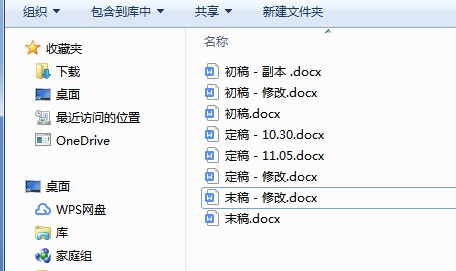

# Git教程（一）

**本文共约2573字，阅读时长大概5~10分钟**

## 前言

### 此教程优点

1. 适合初学者，层层递进，不用担心起步难度
2. 通俗易懂，以学习的方式讲述，便于理解
3. 实用性强，边学边练，不脱离实际应用

### 此教程受众

- 面向初学者，让学习者可以理解并使用git，但并不能成为git专家
- 很多git命令我们并不需要明白并使用，因为我们在实际开发应用当中根本不会用到。我们只需要学习常用的功能即可。
- 那些高阶复杂困难的东西等到非用不可的时候再去研究请教吧。

---

## Git简介

### Git是什么？

- Git可以说是世界上目前最先进的分布式版本控制系统**软件**，是开发人员必备的技能。

### Git的特征

- 版本控制
- 分布式

### 版本控制是什么意思？

#### 工作中的三个困难

- 我们日常写Word经常会遇到三个问题：

1. 困难一

文档永远不是一次就写好的，总是要经过反复的修改，他人的指正修订，以及不同思路逻辑线的抉择才能最终敲定一篇完整的文档。

- 于是写着写着我们存放Word的文件夹就变成了这样：

#### 版本

- 上图中对一个项目的不同修改完善产生了项目的不同版本，包括自己的修改的与同事修改的都叫不同版本。

2. 困难二

还没结束呢，中途要是我们脑瓜灵光一闪，突然觉得现在写的没之前的好，我想找回那一篇更好的文章，那能怎么办？

- 只好一个文档一个文档的找，看哪一篇才是我想要的。
- 麻烦吧？超级麻烦。删吧怕哪天会用上，不删吧堆着又难管理。

3. 困难三

还有呢，在公司里，有些文档是需要同事之间互相帮忙填写的。我就会把我已经写了一部分的文档Copy给同事修改，然后我也不能等着啊，我就得和我同事继续分别修改Word。过了几天后，同事的工作完成了，他再把文档Copy给我。

此时我就又会遇到一个问题：

- 直接全文复制粘贴是不行的。
- 我必须想想，他改动了哪些部分，我又添加了哪些部分。
- 然后最后怎么合并在一起。

一通操作下来，我们会发现这**版本的选择、管理、合并等**也实在太麻烦了。

#### 版本控制

- 版本控制便指的是记录不同版本的改动，版本的选择，版本的合并，版本的删除创建等其他对版本之间的操作。

#### 从人工版本控制到版本控制系统

经过上述问题困难的折磨，终于有人想到可以开发出一个软件：

- 自动帮我们记录不同版本之间的改动区别
- 具有存储库，不用传来传去也能与同事一起同时编辑工作
- 只需几行命令，便可轻易实现不同版本的合并，版本的创建与删除等功能

这种软件就是版本控制系统。**Git就是其中之一。**

### Git有趣的诞生经历

#### 手工管理开源的Linux代码

1991年，Linus创建了开源的Linux系统。开源就代表了任何人都可以为Linux的发展尽一份自己的微薄之力，也就是世界各地的开发人员都可以将自己修改的源代码文件传给Linus，然后由Linus将其合并。

可想而知，这么多的人就有这么多的代码，人工管理起来是十分困难且复杂的。但事实上，在2002年之前，Linus都没使用过版本控制系统，而一直是通过手工方式合并代码！

其实当时就已经存在了许多版本控制系统。但是免费的如CVS、SVN是集中式的版本控制系统，不仅速度极慢，而且还需要联网才能工作。而付费的虽然比CVS、SVN好用，但是与Linux的开源精神不符。于是Linus宁愿人工也不愿使用当时的版本控制系统。

#### 使用版本控制系统BitKeeper

直到2002年，发展了十年的Linux，代码库之大已经很难让Linus继续通过手工方式管理了，Linux社区的用户们也对手工管理的效率低下表示强烈不满，于是Linus只好选择了一款商业版本控制系统BitKeeper，并且BitKeeper的东家BitMover还十分人道主义，特授权Linux社区免费使用这个版本控制系统。

但是到了2005年，Linux社区内一个叫Andrew的程序员（开发了Samba）试图去破解BitKeeper的协议 ，其实这么干的也不只他一个（毕竟Linux牛人众多，艺高人胆大嘛），但不被发现还好，怕就怕在被BitMover公司发现了。于是BitMover公司宣布要收回Linux社区的免费使用权。

一般来说，Linus可以请BItMover的高层们吃顿饭，坐下来好好谈谈，道个歉，保证以后一定对自己社区用户的不良行为严格管教，这事就可以一笔带过了。

但，那是一般人，那不是Linus。

#### Git诞生

经过这件事后，Linus发现用别人的总是有各方面的掣肘，随时可能被撤掉使用权，并且功能方面也不能完全让自己满意（商用的也不开源，自己还不能在其基础上进行改进，太麻烦了）。

那怎么办？那就自己做一个呗。

于是Linus就花了两周时间自己用C写了一个分布式版本控制系统，就是Git！一个月之内，Linux系统的源码已经完全由Git来管理了！

或许这就是牛人本牛吧。（事实上，Linux的诞生，也只是因为Windows系统在当时太贵了用不起而已......）

之后， Git迅速成为最流行的分布式版本控制系统，尤其是2008年，GitHub网站上线了，它为开源项目免费提供Git存储，无数开源项目开始迁移至GitHub，包括jQuery，PHP，Ruby等等。 

- 我常说，Linus能用两周时间做一个Git，我用两个月时间开发一个大项目也完全不是问题。
- 哈哈哈，开玩笑。

### 分布式是什么意思？

在此之前，我们已经提到过，CVS及SVN都是集中式的版本控制系统，并且又慢还要联网，那么为什么集中式和分布式会有这些区别呢？两者又具体怎么工作的呢？

我们先从集中式的版本控制系统开始讲起。

#### 集中式的版本控制系统

- 所有文件的所有版本集中存放于中央服务器，在自己电脑上工作的时候就需要先从中央服务器（远程仓库：建立在服务器上的文件夹）取得自己要修改文件的最新版本，然后开始工作，工作完了再上传到中央服务器。
- 致命缺点：联网工作
- 局域网内，带宽大，速度快还可以接受。要是在互联网上，有时候网速慢，提交一个10M的文件都需要5分钟就完全不能忍受了。

#### 分布式的版本控制系统

- 分布式版本控制系统没有“中央服务器”，每个人电脑商都有一个完整的版本库（本地仓库：建立在本地的文件夹），工作的时候根本不需要联网。
- 多人协作：将互相的文件传给对方即可看到彼此的修改。
- 安全性高：每个人电脑上都有一个版本库，备份多，不怕丢。
- 实际上，分布式版本控制系统通常也有一台**充当“中央服务器“**的电脑，因为很少两人在同一个局域网内互传修改。但这个服务器仅仅用来方便大家的”交换“，**并不必要**。只是没有它，交换不方便而已。

### Git不是Github

- 简单来讲，Git是一个软件，Github是一个服务器登陆管理网站。
- 上一层来说，Git是一个分布式版本控制系统，Github是一个远程仓库，相当于一个存放在外网服务器上的文件夹。
- Github对于Git来说并不是必要。
- Git才是关键。学会并使用Git才可以解决上述我们说到的三个问题。Github只是帮助到我们与其他人交换文件罢了。
- 换句话说，为了安全，我们都尽量避免他人直接访问自自己电脑上的文件夹（即本地仓库）获取文件，但是频繁互传文件又太麻烦，所以我们在彼此都可以访问到的远端服务器上建一个文件夹（即远程仓库，即Github或国内的Gitee码云），只存储我们需要交换的文件，这样既避免其他文件泄露又保护自己电脑安全，还能彼此互相获取到最新版本文件。

## 小结

现在总结一下今天学到的两个内容：

- Git是什么？（有什么用？）
- Git的两大特征（分两点）
  1. 版本控制是什么？
  2. 分布式是什么意思？