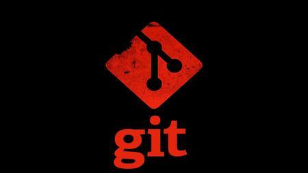
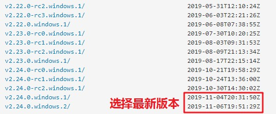
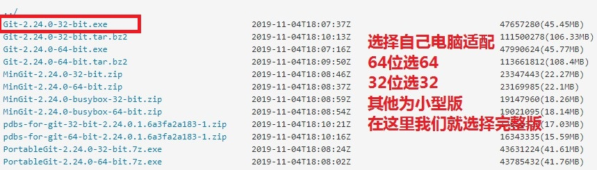
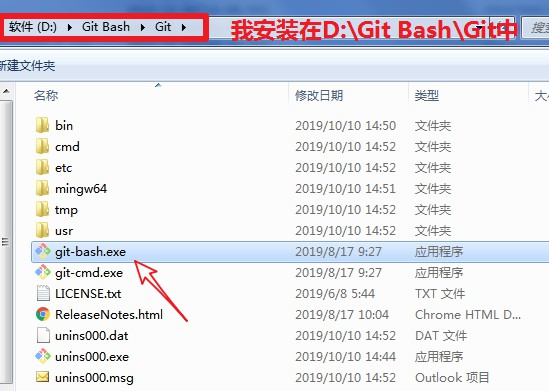
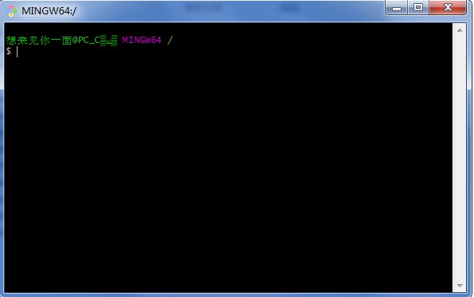
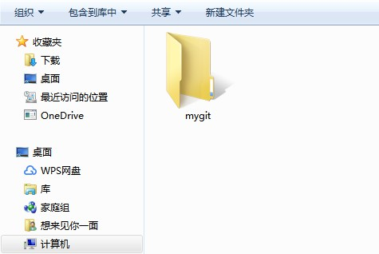
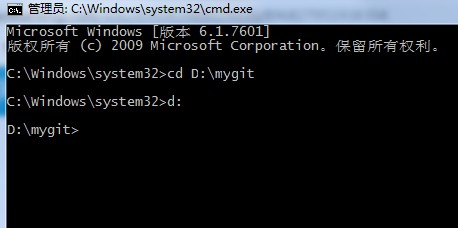
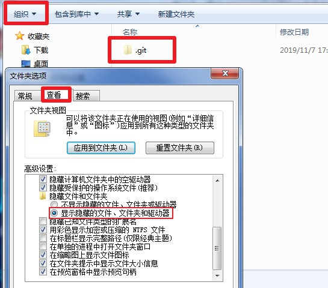
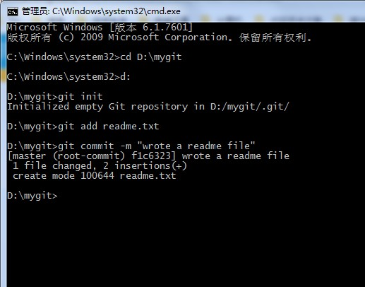

# Git教程（二）

**本文共约2888字，阅读时长大概7~13分钟**

## 安装Git



### 在Linux上安装Git

#### 验证是否已安装Git

- 首先，可以尝试输入`git`,看看系统有没有安装Git：

```linux
$ git
The program 'git' is currently not installed. You can install it by typing:
sudo apt-get install git
```

- 有时，你没安装git，很多Linux还会像上面那样（第二行）友好提示你Git没有安装，（第三行）告诉你如何安装Git。

#### 命令安装Git

-  如果你碰巧用Debian或Ubuntu Linux，通过一条`sudo apt-get install git`就可以直接完成Git的安装，非常简单。 
-  老一点的Debian或Ubuntu Linux，要把命令改为`sudo apt-get install git-core`。因为以前有个软件也叫GIT（GNU Interactive Tools），结果Git就只能叫`git-core`了。由于Git名气实在太大，后来就把GNU Interactive Tools改成`gnuit`，`git-core`正式改为`git`。 

#### 官网下载安装

-  其他版本可以直接通过源码安装。先从[Git官网]( https://git-scm.com/downloads )下载源码，然后解压，依次输入：`./config`，`make`，`sudo make install`命令安装即可。 
-  输入` $ git version`

- 出现git版本相关消息说明成功

### 在Mac OS X上安装Git

#### 通过homebrew安装

-  homebrew是一款Mac平台的软件包管理工具，官方对于它能做什么的回答是：“Homebrew 使 macOS 更完整。使用 gem 来安装 gems、用 brew 来安装那些依赖包。” 

##### 安装homwbrew

```Mac Os X
usr/bin/ruby -e "$(curl -fsSL https://raw.githubusercontent.com/Homebrew/install/master/install)"
```

-  有时候会没有连接到地址，有时候会直接返回false、error，多试几次然后就行了。
- `$ brew`测试homebrew是否安装成功
- `$ brew intall git`安装git，极其漫长等待之后，安装完成。

##### 配置使用Git用户名和用户邮箱

```Mac Os X
$ git config --global user.name "your_name"  
$ git config --global user.email "your_email@gmail.com"
```

-  使用`$ git config --list`来查看Git的配置信息；
-  使用`$ git config core.ignorecase false`设置Git为大小写敏感。 

##### 生成密钥

-  Git关联远端仓库时候需要提供公钥，本地保存私钥，每次与远端仓库交互时候，远端仓库会用公钥来验证交互者身份。
- 使用` $ ssh-keygen -t rsa -C "your_email@youremail.com" `指令生成密钥。 
-  在`/Users/当前电脑用户/.ssh`目录下会生成两个文件`id_rsa`、`id_rsa.pub`，`id_rsa`文件保存的是私钥，保存于本地，`id_rsa.pub`文件保存的是公钥，可于远端仓库添加公钥。 

##### 向远端仓库添加密钥

1. 获取公钥
   -  在终端中输入`cd /Users/当前电脑用户/.ssh`进入该目录
     输入`cat id_rsa.pub`指令，查看`id_rsa.pub`文件中的内容 
2. 打开远程仓库，点击自己头像打开个人资料， 点击`Settings`->`SSH and GPG keys`。 
3.  然后点击`New SSH Key`，`Title`中的内容可任意编辑，`Key`中填写刚刚获取的`id_rsa.pub`文件中的内容，全部复制粘贴进去，然后点击`Add SSH Key`就添加公钥完成了。 
4.  接下来就可以往Github里创建仓库并与本地仓库同步 。

#### 通过Xcode安装Git

-  直接从AppStore安装Xcode，Xcode集成了Git，不过默认没有安装，我们需要先打开Xcode，选择菜单“Xcode”->“Preferences”，在弹出窗口中找到“Downloads”，选择“Command Line Tools”（命令行工具），点“Install”就可以完成安装了。 


-  Xcode是Apple官方IDE，功能非常强大，是开发Mac和iOS App的必选装备，而且是免费的！ 

### 在Windows上安装Git

-  在Windows上使用Git，可以从Git官网直接[下载安装程序](https://git-scm.com/downloads)，（网速慢的同学请移步[国内镜像](https://npm.taobao.org/mirrors/git-for-windows/)），然后按默认选项安装即可。 





-  安装完成后，在Git安装目录中里找到并点击Git Bash，弹出一个类似命令行窗口，就说明Git安装成功！ 





### 配置使用Git用户名和用户邮箱

-  在自己系统上安装完成后，还需要最后一步设置，在命令行输入： 

```linux
$ git config --global user.name "Your Name"
$ git config --global user.email "email@example.com"
```

-  注意：Git是分布式版本控制系统，所以，每台机器都必须表明身份：自己的名字与来历。以验证此用户是否有操作的权限。
- **否则是无法使用这个Git仓库的！！！**
-  注意`git config`命令的`--global`参数，用了这个参数，表示你这台机器上所有的Git仓库都会使用这个配置，当然也可以对某个仓库指定不同的用户名和Email地址。 

## 创建本地版本库

-  什么是版本库呢？版本库又名仓库，英文名**repository**，你可以简单理解成一个目录，这个目录里面的所有文件都可以被Git管理起来，每个文件的修改、删除，Git都能跟踪，以便任何时刻都可以追踪历史，或者在将来某个时刻可以“还原”。 

### 创建一个空目录

- 在一个合适的地方，创建一个空目录（我创建的为mygit）
- Windows系统为了避免各种奇妙的问题，请确保路径名不包含中文。



### 将文件夹变成Git可管理的仓库

- 在控制台cmd中`cd <此文件路径>`移到此文件夹下



-  通过`git init`命令把这个目录变成Git可以管理的仓库： 

```cmd
D:\mygit>git init
Initialized empty Git repository in D:/mygit/.git/
```

- Git很快就把仓库`initialized`建好了，而且告诉你是一个空的仓库`empty Git repository`。建好了那文件夹有什么不同呢？我们进入mygit文件夹里，可以发现当前目录下多了一个`.git`的目录，这个目录是Git用来跟踪管理版本库的，一般是隐藏的，因为一旦被我们不小心动点手脚，这个Git仓库就被破坏了。所以最好还是不让我们看见。

-  如果你没有看到`.git`目录，那是因为这个目录默认是隐藏的， 在文件夹选项中选择“显示隐藏的文件、文件夹和驱动器”即可。



### 添加文件到本地仓库（添加到Git跟踪记录范围下）

#### 注意：Git只能跟踪文本改动

- 首先说明很重要的一点，所有的版本控制系统包括Git，都只能跟踪文本文件的改动，比如TXT文件，网页，所有的程序代码等等。
- 版本控制系统可以告诉我们每次的改动，比如在第5行加了一个单词“Linux”，在第8行删了一个单词“Windows”。而图片、视频这些二进制文件，虽然也能由版本控制系统管理，但没法跟踪文件具体的修改内容，也就是只知道图片从100KB改成了120KB，相当于每次换了张图片，但到底改了啥，版本控制系统不知道，也没法知道。 
-  而Microsoft的Word格式是二进制格式。所以，版本控制系统是没法跟踪Word文件的改动的。如果需要用到版本控制系统观察改动内容，就只能以纯文本方式编写文件。 
-  若不需要记录每次具体改动内容，上述内容就不在考虑范围之内。

#### 文本编码推荐UTF-8

- 文本都是编码存储的。比如中文有常用的GBK编码，日文有Shift_JIS编码，如果没有历史遗留问题，强烈建议使用标准的UTF-8编码，世界上所有语言都可以使用这一种编码，既没有冲突，又会被所有平台所支持。
- 避免出现莫名其妙的乱码问题。

#### 编辑器推荐Editplus或Sublime

- 千万不要使用Windows**自带的记事本**编辑任何文本文件。原因是Microsoft开发记事本的团队使用了一个奇怪的行为来保存UTF-8编码的文件，他们会在每个文件开头添加了0xefbbbf（十六进制）的字符。而这样我们会遇到很多不可思议的问题，比如，网页第一行可能会显示一个“?”，明明正确的程序一编译就报语法错误，等等，都是由记事本的擅自改动带来的。 
- 并且记得将Editplus或Sublime默认编码设置为UTF-8

#### 添加文件到Git可跟踪记录范围下

- 新建一个`readme.txt`（或其他名字）文件，内容随意。
- 放在自己建的git仓库（别的地方git找不到）里头，我这里是`mygit`文件夹（注意：放在mygit中的子文件夹中也可以）。
- 实际上，将文件放入文件夹下并没有真正放入Git仓库下。简单的新建存储git是不会管的，git的工作机制并不是主动对文件夹一直监控，而是被动跟踪。
- 换句话说，我们告诉git我们对此文件做了一些改动，git才会去跟踪并记录我们具体做了哪些改动，并生成一个版本号来标记这个版本，并把此版本内容记录在git仓库中。而不是我们无时无刻添加修改删除做点小改动，git便自动记录，我们可以想到，git会生成多少个版本，而那样git就没用了。
- 这样就需要我们每次改动后，要告诉git：跟踪它的改动吧

```cmd
D:\mygit>git add readme.txt
```

- 执行上面的命令，不会有任何显示——说明添加成功。
- 若是想告诉git所有文件都跟踪一下吧，我忘记具体改动哪些了，那就使用下面的命令。

```cmd
D:\mygit>git add .
```

- 第二步，用命令`git commit`告诉Git，把此版本文件记录提交到真正的git仓库：

  ```cmd
  D:\mygit>git commit -m "wrote a readme file"
  [master (root-commit) eaadf4e] wrote a readme file
   1 file changed, 2 insertions(+)
   create mode 100644 readme.txt
  ```

- 解释一下`git commit`命令，`-m`参数后面输入的是本次提交的说明，最好是对此次改动的简短描述，这样我们就能很方便的在历史记录里区别每次改动，并选择我们需要的版本。

-  `git commit`命令执行成功后会告诉我们，`1 file changed`：1个文件被改动（我们新添加的readme.txt文件）；`2 insertions(+)`：插入了两行内容（readme.txt有两行内容）。 



- `commit`可以一次提交很多文件，所以你可以先多次`add`添加不同的文件再`commit`提交，比如：

```cmd
D:\mygit>git add file1.txt
D:\mygit>git add file2.txt file3.txt
D:\mygit>git commit -m "add 3 files."
```

## 小结

现在总结一下今天学的三个内容：

- 在自己电脑相应系统上安装Git

- 初始化一个Git仓库，使用`git init`命令。

- 添加文件到Git仓库，分两步：

1. 使用命令`git add `，注意，可反复多次使用，添加多个文件进行跟踪；
2. 使用命令`git commit -m <message>`，此版本内容记录完成。