# Git教程（三）

**本文共约3901字，阅读时长大概10~16分钟**

## 版本回退


### 查看仓库当前状态

- 之前我们已经学会了如何修改版本库里的文件，并且我们还知道Git的功能是可以帮助我们记录文件的修改情况的。那我们接下来就先学习如何查看仓库的改动状态与文件内容具体修改情况吧。

#### 问题场景

我们在工作的时候，有时候会想清晰的知道已经做了哪些工作。

- 比如我们的仓库里有很多文件，我们需要对其中某几个文件里的bug进行修复，我们知道改bug没那么快，有时候改着改着就忘了之前到底改了哪几个文件里的bug。
- 一个一个查阅肯定太麻烦，有时候我们会自己在心里、或笔记上做一个记录，记录哪些是已经修改过的。
- 那么，这种既简单又不需要智力但麻烦的工作直接交给Git就好了。

#### 命令预习

- 在存放git仓库的文件夹下使用命令`$ git status`即可

#### 实操训练

之前我们已经在Git仓库中添加了一个`readme.txt`文件，现在，我们对它进行修改，内容为：

```txt
hello Git
are you happy
```

现在，运行`$ git status`查看结果

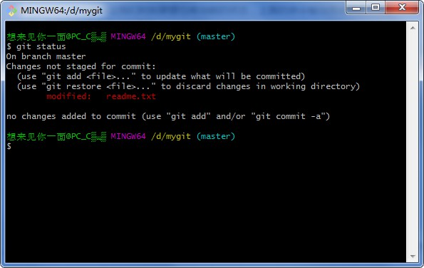

```cmd
$ git status
On branch master
Changes not staged for commit:
  (use "git add <file>..." to update what will be committed)
  (use "git restore <file>..." to discard changes in working directory)
        modified:   readme.txt

no changes added to commit (use "git add" and/or "git commit -a")
```

- 我们通过Git反馈的结果来看，知道了`modified:   readme.txt`即仓库里`readme.txt`文件被修改了 ，`no changes added to commit`但还没有准备提交的已添加的修改。
- `(use "git restore <file>..." to discard changes in working directory)`是使用命令撤销更改的意思。使用后内容变为旧版本。

- 并且还告诉我们使用什么命令添加并提交修改`(use "git add" and/or "git commit -a")`。

- `On branch master`还未涉及可以先不考虑，之后在“分支管理”中会讲到。

---

### 查看文件具体修改内容

#### 问题场景

虽然通过`git status`命令可以知道仓库中readme.txt文件被修改了，但要是能知道文件具体改动的内容，那就更方便了。

- 比如我们上周被安排了一个修改任务，还在修改的途中，中间又被安排去处理另一件更紧急的事去了，等到把这件更紧急的事完成，我们还要回来继续上周的修改任务。
- 但这个时候，我们就需要知道我们对上周任务的文件到底修改了什么。

- 那么，这种既简单又不需要智力但麻烦的工作直接交给Git就好了。

#### 命令预习

- 在存放git仓库的文件夹下使用命令`$ git diff`即可。

#### 实操训练

在存放`readme.txt`文件夹下运行`$ git diff`查看结果

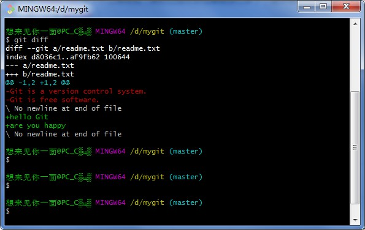

```cmd
$ git diff
diff --git a/readme.txt b/readme.txt
index d8036c1..af9fb62 100644
--- a/readme.txt
+++ b/readme.txt
@@ -1,2 +1,2 @@
-Git is a version control system.
-Git is free software.
\ No newline at end of file
+hello Git
+are you happy
\ No newline at end of file
```

- diff 是 difference 的意思，即查看与修改之前状态的不同处。
- 结果显示的格式是Unix通用的diff格式 
- `@@ -1,2 +1,2 @@` @@表示文件变动描述，合并显示的开始和结束，一般在变动前后多显示3行，其中-+表示变动前后，逗号前是起始行位置，逗号后为从起始行往后几行。合起来就是变动前后都是从第1行开始，变动前后文件往后数2行结束。  
- 删除第一行、第二行两行内容（我新建readme.txt时输入的内容，每个人不一样）

```cmd
-Git is a version control system.
-Git is free software.
\ No newline at end of file
```

- 添加第一行、第二行两行内容

```cmd
+hello Git
+are you happy
\ No newline at end of file
```

---

接下来我们再尝试修改一次，将`readme.txt`内容修改为：

```txt
hello Git!
are you happy?
```

保存文件后，运行`$ git diff`查看结果

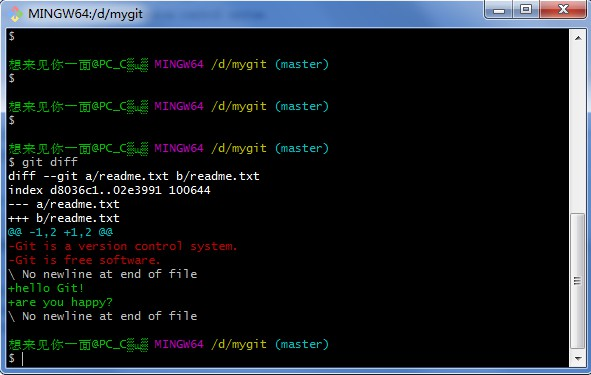

```cmd
$ git diff
diff --git a/readme.txt b/readme.txt
index d8036c1..02e3991 100644
--- a/readme.txt
+++ b/readme.txt
@@ -1,2 +1,2 @@
-Git is a version control system.
-Git is free software.
\ No newline at end of file
+hello Git!
+are you happy?
\ No newline at end of file
```

- 我们发现，新内容是刚刚修改的内容，而旧内容却是最初版本的readme.txt。
- 我们按照上一节内容可以推出，这是因为git还没有真正将第一次修改的版本添加至git仓库当中。我们每次修改完成后都需要添加并提交才可以使我们修改的版本真正入库。

---

我们保持内容不变，执行`git add`添加

```cmd
$ git add readme.txt
```

同样没有任何反馈。并且在执行提交之前，我们也可以用`git status`查看仓库的当前状态：

```cmd
$ git status
On branch master
Changes to be committed:
  (use "git restore --staged <file>..." to unstage)
        modified:   readme.txt
```

- `Changes to be committed:`告诉我们，将要被提交的修改文件有`readme.txt`文件
- `(use "git restore --staged <file>..." to unstage)`是使用命令恢复状态的意思。使用后，恢复未添加前的状态。

查看将要提交的修改文件与内容后，我们就可以放心提交了：

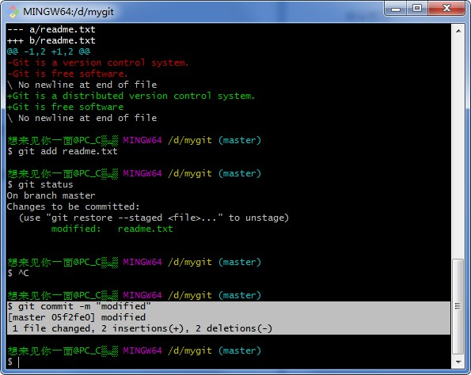

```cmd
$ git commit -m "modified"
[master 05f2fe0] modified
 1 file changed, 2 insertions(+), 2 deletions(-)
```

我们很清楚的看到，此次提交，一个文件被修改，两个添加，两个删除。

提交后，我们再用`git status`命令看看仓库的当前状态： 

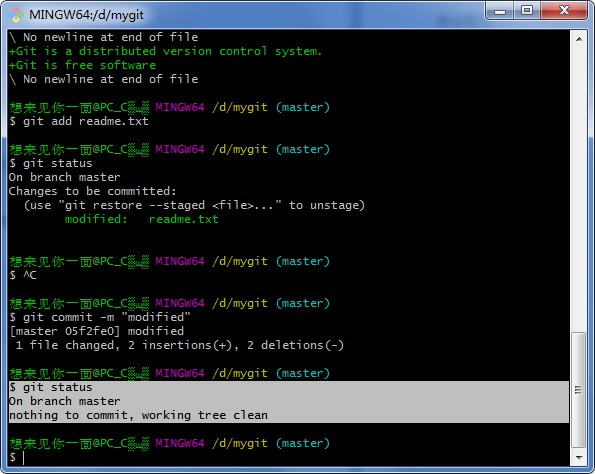

```cmd
$ git status
On branch master
nothing to commit, working tree clean
```

 Git告诉我们当前没有需要提交的修改，而且工作目录是干净`working tree clean`的。 

---

### 版本回退

#### 问题场景

在此之前，我们学会了修改文件并提交到版本库里。现在我们就开始学习如何找到之前提交的版本，并回退至之前的版本内容。

- 比如我们的电脑，经常会出现各种各样的问题，不小心中病毒啊，垃圾太多呀，删改了重要文件啊之类的，这个时候我们会选择还原，即找到一个还原点，还原我们电脑的状态。
- Git也是一样，我们将文件修改到一定程度的时候就可以先提交保存这个版本（即commit），一旦我们把文件误删了，改乱了，就返回到这个版本里，然后再继续工作，而不是一旦失误，就从头再来。
- 其他方面也是如此，我们一定要学会备份！（经验之谈）

#### 命令预习

- 使用命令`git log`查看从最近到最远的提交日志找到要回退版本的`<commit id>` 。
- 使用命令`git reset --hard <commit_id>`返回历史版本。
- 返回到过去之后，`git log`便不会再显示当前时间之后的提交日志。想要重返未来版本，只能先使用命令 `git reflog`查看使用命令的历史记录找到未来的`<commit_id>`，再使用命令`git reset --hard <commit_id>`返回。

#### 实操训练

 首先我们回顾一下`readme.txt`文件一共有几个版本被提交到Git仓库里了： 

版本1（我最初写进去的内容，每人不同）：

```txt
Git is a version control system.
Git is free software.
```

版本2：

```txt
hello Git!
are you happy?
```

##### 找到回退版本的`<commit id>`

- 使用`git log`命令查看过去的历史提交记录

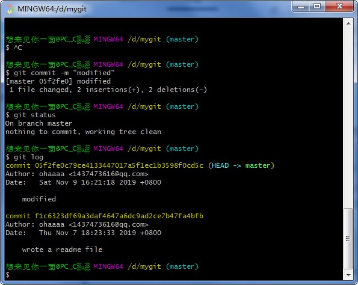

```cmd
$ git log
commit 05f2fe0c79ce4133447017a5f1ec1b3598f0cd5c (HEAD -> master)
Author: ohaaaa <1437473616@qq.com>
Date:   Sat Nov 9 16:21:18 2019 +0800

    modified

commit f1c6323df69a3daf4647a6dc9ad2ce7b47fa4bfb
Author: ohaaaa <1437473616@qq.com>
Date:   Thu Nov 7 18:23:33 2019 +0800

    wrote a readme file
```

- `git log`命令是输出过去的最近到最远的历史提交日志.
- 我们可以看到两次提交，最近到最远是由上至下。最近是`modified`，上一次是`wrote a readme file`。
- 每一次提交中包含信息有：
  1. `<commit_id>`，即一大长串字符串，如我这里的05f2fe0c79ce4133447017a5f1ec1b3598f0cd5c（不要奇怪，你的和我的肯定不一样哦）
  2. 提交者信息——`Author`，名称和邮箱
  3. 提交日期——`Date`
  4. 以及每次提交的简略说明
- 如果觉得输出信息太多，太乱，可以使用` --pretty=oneline`参数（注意--之前有空格）

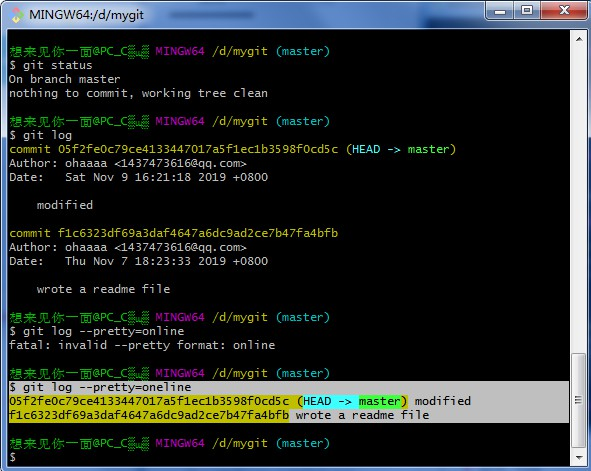

```cmd
$ git log --pretty=oneline
05f2fe0c79ce4133447017a5f1ec1b3598f0cd5c (HEAD -> master) modified
f1c6323df69a3daf4647a6dc9ad2ce7b47fa4bfb wrote a readme file
```

- 添加此参数后，每个版本都只会显示`<comimit_id>`和提交说明两条信息
- 另外补充一点，为什么`<commit_id>`这么复杂，不直接用1,2,3...来表示呢，因为Git不光为我们自己一个人服务，之后我们还需要和别人共同协作，如果大家都是1,2,3...作为版本号，那肯定就冲突了对吧。

---

##### 回退到其他版本

现在我们获得了`readme.txt`文件过去所有版本的`<commit_id>`，并且知道每个版本的简略说明，我们就可以使用命令`git reset`回退到任意我们想要返回的位置。

当然啦，我们这里只有两个版本，那就回到上一个版本吧。

- 上一个版本的`<commit_id>`是f1c6323df69a3daf4647a6dc9ad2ce7b47fa4bfb，在使用回退命令的时候，其实我们只需要写版本号的前几位就ok了，如f1c63。
- 我们只需要保证Git找得到分得清这个版本号是指的哪个版本即可。
- 但不能太短，太短有可能会和其他版本号的前几位重复，Git就分不清了。

使用`git reset --hard f1c63`命令查看结果：

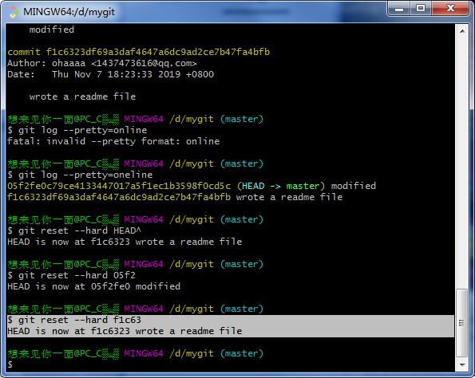

```cmd
$ git reset --hard f1c63
HEAD is now at f1c6323 wrote a readme file
```
果然回到过去了。

- ` --hard`参数是回退的方式，先不用考虑，后面章节会讲到。
- 如果忘了写也不要慌张，使用`git reset --hard 原本的版本号`返回未来，然后再重新使用`git reset --hard f1c63`回到过去即可。
- 原版本号即之前`git log`中原版本的版本号字符串，但现在`git log`是不会显示原本的版本号的，`git log`只会显示当前版本**之前**的提交历史，未来的不会显示。
- 我们可以往上翻翻，就可以找到原版本的`<commit_id>`了。
- `HEAD`指的是当前版本。Git还告诉我们当前版本是`f1c6323`这个版本，并指出版本说明。

但是使用久了之后，我们会发现回退到很久之前这种情况并不经常发生，我们其实一般都只会回退上个版本，或者上上个版本即很近的版本。

那每次回退我们都要找到版本号，那岂不是太麻烦了？

- 那么，这种既简单又不需要智力但麻烦的工作直接交给Git就好了。

好的，先让我们回到未来再以另一种更简便的方法回到过去，不知道怎么回到未来？很简单，和回到过去同样方式：

- 只要知道想去地方的版本号，我们就哪里都可以去啦。Git就是我们的司机，我们只需要告诉他目的地就行了。

使用`git reset --hard 05f2`命令查看结果：

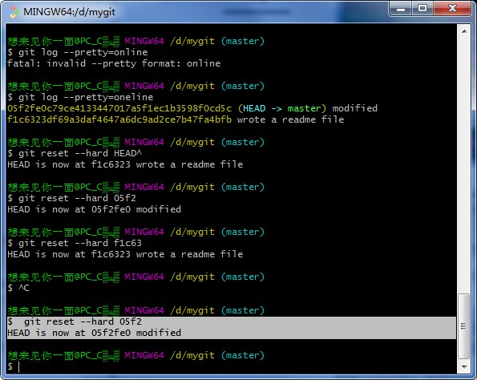

```cmd
$  git reset --hard 05f2
HEAD is now at 05f2fe0 modified
```

好的，现在我们就回来了。

那么，我们来使用另一种更简便回到过去的方式。

在Git中，我刚刚说过是用`HEAD`表示当前版本，也就是`HEAD`表示的就是`05f2fe0c79ce4133447017a5f1ec1b3598f0cd5c`表示的版本。

- 换句话说，Git识别的`HEAD`就是`05f2fe0c79ce4133447017a5f1ec1b3598f0cd5c`这个版本。
- 我们直接使用`git reset --hard HEAD`就是回到当前。

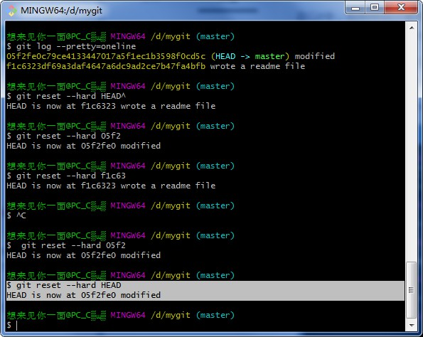

- 当然啦，回到当前那不是多此一举嘛，哈哈，我只是举个例子。
- 但是我们可以根据此原理来理解回到过去版本的简略版命令。
- 当前版本是`HEAD`,Git就相应规定上个版本为`HEAD^`，上上个版本就为`HEAD^^`，举一反三，往前一百个版本就是一百个`^`，当然啦，写一百个`^`也是不可能的，我们写成`HEAD~n`，来回退到往前第`n`个版本的位置。

那么，接下来我们就来使用`git reset --hard HEAD^`来查看结果：

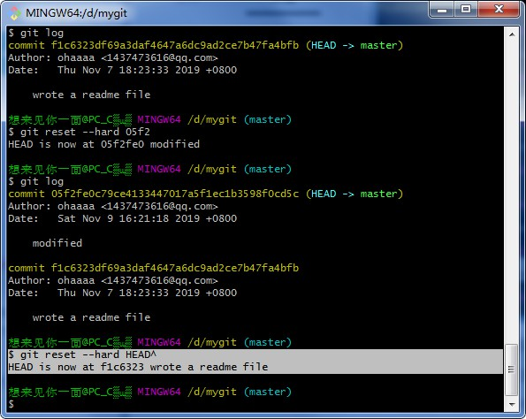

```cmd
$ git reset --hard HEAD^
HEAD is now at f1c6323 wrote a readme file
```

果然我们又回到过去了。Git真是超级方便。

---

 Git的版本回退速度十分高效，原理是Git在内部有个指向当前版本的`HEAD`指针，当我们回退版本的时候，Git仅仅是把HEAD从指向`modified `（版本说明）：

```ascii
┌────┐
│HEAD│
└────┘
   │
   └──> ○ modified 
        │
        ○ wrote a readme file
```

改为指向`wrote a readme file`：

```ascii
┌────┐
│HEAD│
└────┘
   │
   │    ○ modified 
   │    │
   └──> ○ worte a readme file
```

 然后顺便把工作区即我们文件夹下的文件更新了。所以我们让`HEAD`指向哪个版本号，就能把当前版本定位在哪。

---

##### 使用`git reflog`命令查看我的每一次命令操作

好的，现在我们遇到一个问题。我们已经回退到了旧版本，但今天不想继续工作了，然后你关掉了电脑去睡觉。第二天早上一起来就后悔了，想恢复到昨天原来的版本即回到未来，那怎么办？

有人会说了，之前不是已经操作过回到未来嘛。再`git reset`一次不就好了。

不是哦，那次回到未来，是我们往命令行窗口上翻呀翻找到原版本的`<commit_id>`的。可这次，命令行窗口被我们关掉了啊，那还咋找呢？

有人说，`git log`呀，不行哦，这条命令只能显示当前版本过去的历史哦。

那怎么办？要是记录了每次版本之间的移动就好了，就可以找到原版本号了。

- 那么，这种既简单又不需要智力但麻烦的工作直接交给Git就好了。
- Git提供了`git reflog` 命令来查看我们的每一次命令操作，我们就可以在其中找到原版本号。

使用`git reflog`命令查看结果：

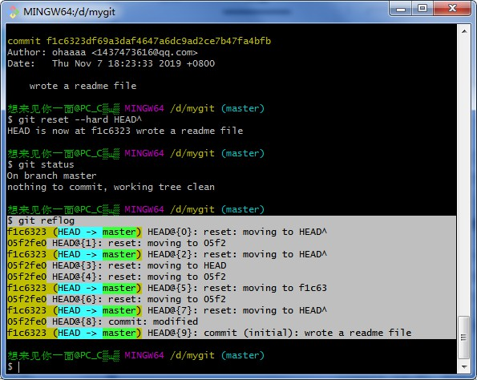

```cmd
$ git reflog
f1c6323 (HEAD -> master) HEAD@{0}: reset: moving to HEAD^
05f2fe0 HEAD@{1}: reset: moving to 05f2
f1c6323 (HEAD -> master) HEAD@{2}: reset: moving to HEAD^
05f2fe0 HEAD@{3}: reset: moving to HEAD
05f2fe0 HEAD@{4}: reset: moving to 05f2
f1c6323 (HEAD -> master) HEAD@{5}: reset: moving to f1c63
05f2fe0 HEAD@{6}: reset: moving to 05f2
f1c6323 (HEAD -> master) HEAD@{7}: reset: moving to HEAD^
05f2fe0 HEAD@{8}: commit: modified
f1c6323 (HEAD -> master) HEAD@{9}: commit (initial): wrote a readme file
```

哈哈，找到了。我们可以看到，`modified`的版本号为`05f2fe0`，现在，我们又可以回到未来啦。

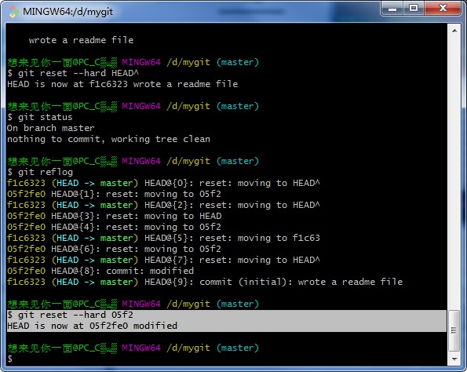

```cmd
$ git reset --hard 05f2
HEAD is now at 05f2fe0 modified
```

回到未来成功！

---

### 小结

现在总结一下今天学的三个内容：

- 查看仓库当前状态`git status`
- 查看文件具体修改内容`git diff`
- 版本回退
  1. 查看过去版本提交历史记录`git log`，找到想要回退的版本号
  2. 查看每一次命令操作记录`git reflog`，找到未来的的版本号
  3. `git reset --hard <commit_id>`回退即可。


