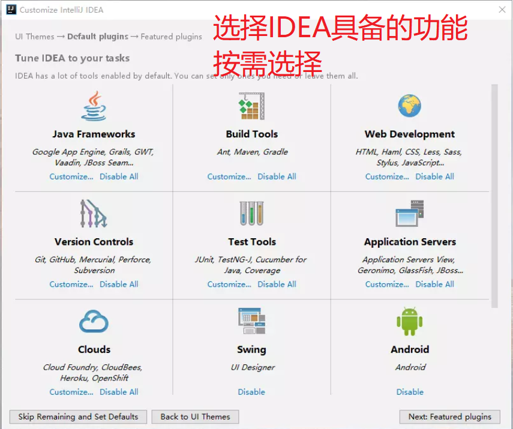

# IDEA安装激活使用图文教程

## 前言

1. 开发不易，希望有经济实力的小伙伴们多多**支持正版**。
2. 以下所有内容只做入门学习所用，不要用于商业用途。
3. 文中方法亲测演示 IntelliJ IDEA 2019.2.1 版本（高版本也适用，请放心）。
4. 彩蛋：事实上Jetbrians系列下所有软件安装激活步骤都是一样的。

## 目录

1. 下载
   1. 下载步骤
   2. 安装版与免安装版的区别
   3. JBR是什么
2. 安装激活
   1. 安装
   2. 基础配置
   3. 激活
3. 汉化
4. 使用

## 1.下载

- 官网下载地址：[https://www.jetbrains.com/idea/download/other.html ](https://www.jetbrains.com/idea/download/other.html )
- 选自己的操作系统类型
- 选自己所需要的功能版本

### 1.安装版与免安装版的区别？

- 免安装版即常说的绿色版软件
- 安装版需要有一个简单的安装过程用于设置软件属性
- 免安装版直接解压即可运行，采用默认设置
- 安装版会在系统的注册表写入信息，添加一些便捷功能，如右键打开软件编辑文件夹等，但是卸载的时候只删除软件的文件会给注册表留下垃圾，我们可以使用卸载工具来清除这些垃圾。
- 免安装版，卸载的时候只需删除文件即可

### 2.JBR是什么？

- JetBrians Runtime，JetBrians系列软件运行环境
-  用于在Windows，Mac OS X和Linux上运行基于IntelliJ平台的产品。 
-  JetBrains Runtime基于OpenJDK项目（开源的JDK源码），对官方JDK进行了一些修改，使旗下的软件更好用，更稳定。这些修改包括： Subpixel Anti-Aliasing ，Linux上增强的字体渲染，HiDPI支持，连字，以及官方版本中未提供的一些针对本机崩溃的修复程序和其他小的增强功能。  
-  JetBrains Runtime不是OpenJDK的认证版本。请自担风险使用。 

选择好了点击下载，然后静静等待下载完成。

## 2.安装激活

### 1.安装

- 双击下载完成的ideaIU-2019.2.1.exe（我下载的版本）
- 安装步骤

- IDEA安装完成

### 2.基础配置

- 启动第一次IDEA

- 直接next即可

- 基础配置完成

### 3.激活

- 下载破解文件 jetbrains-agent.jar 
- [https://pan.baidu.com/s/1NwBCXh04zpa_cbbJLZtkjw](https://pan.baidu.com/s/1NwBCXh04zpa_cbbJLZtkjw)

- 提取码：bd8s

- 其他都无用，删掉也没问题
- 将jetbrains-agent.jar 放在idea安装文件同级目录下

- 再次启动IDEA

- 即让计算机找到jetbrains-agent.jar
- 注意这里一定要正确，否则可能IDEA就打不开了
- 打不开解决方法： 删除用户目录下的idea的的隐藏文件夹的内容 
- 即 文件夹 **C:\用户\\\.IntelliJIdea2019.2\\**中的全部内容
- 
- 然后重启即可运行
- 接下来选择激活方式
- 记得选择激活方式之前，即设置破解文件属性之后
- 需要重启！重启！重启！重要的话说三遍。

- http://jetbrains-license-server
- 或者选择激活码安装
- 两者区别在于激活时间，服务器永久，激活码七十年
- 但是，我们可能都用不到那个时候了，哈哈哈
- 推荐使用服务器激活

- 激活成功！
- 重启即可。

## 3.汉化

- [下载汉化包]( https://github.com/pingfangx/jetbrains-in-chinese)

- 打开idea安装目录，打开lib文件夹
- 复制进去即可，不用删除任何文件

- 重启IDEA即可。
- 汉化后，可能因为版本不适的原因，会出现很多功能按钮打不开的问题，如果遇到这种问题，必须要解决的话，最好还是不要用汉化哦，直接删掉汉化文件就可以了。
- 或者实在要用的话，就找最新版本的汉化包尝试看看。

## 4.使用

### 1.